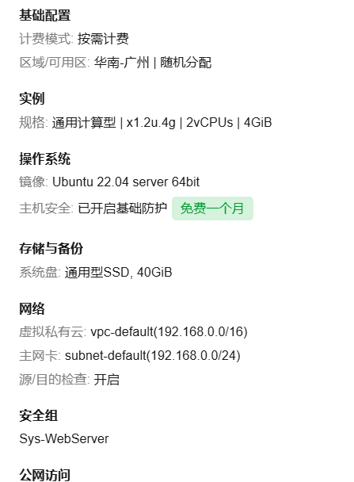
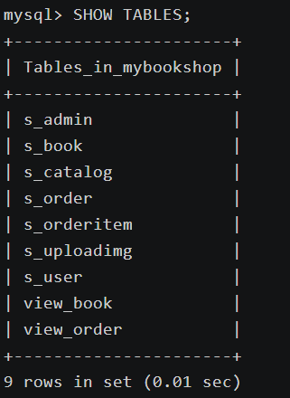
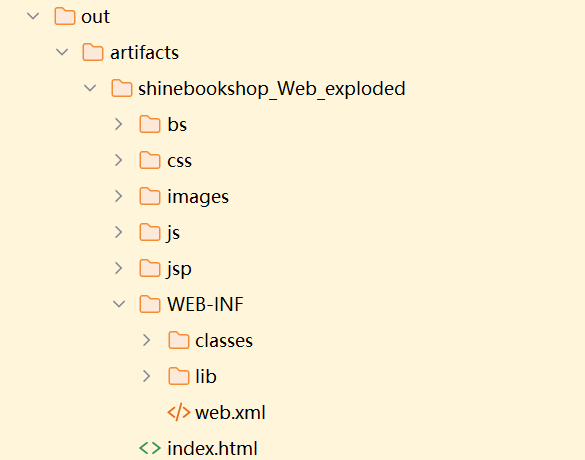

# 作者信息

- 班级：23级网络工程

- 姓名：曾婧茹

- 学号：202330452242

# 使用说明

http://113.46.205.78:8080/

点击上面的链接，即可进入首页。

用户名：user  密码：1234 （也可以自己注册一个）

管理员：admin 密码：admin

# 开发说明

## 核心环境

| 软件环境     | 推荐版本                                                     |
| ------------ | ------------------------------------------------------------ |
| JDK          | JDK 8（1.8.x）                                               |
| Tomcat       | Tomcat 9.x / 8.5.x                                           |
| MySQL        | MySQL 5.7 / 8.0                                              |
| MySQL 驱动包 | mysql-connector-java 5.1.49（适配 MySQL5.7）/ 8.0.30（适配 MySQL8.0） |
| 操作系统     | Ubuntu 20.04/22.04 LTS（服务器）                             |

## 项目结构

```
bookshop (项目根目录)
│
├── src/                          ← 源代码目录
│   ├── com/shine/bookshop/
│   │   ├── servlet/             (Java源代码)
│   │   ├── dao/
│   │   └── bean/
│   └── ...
│
├── WebContent/                   ← Web资源目录
│   ├── WEB-INF/
│   │   ├── web.xml              (配置文件)
│   │   └── lib/                 (依赖jar包)
│   ├── jsp/                     (JSP页面)
│   ├── css/
│   ├── js/
│   ├── images/
│   └── ...
│
└── out/artifacts/shinebookshop_Web_exploded/  ← 编译输出+部署目录
    ├── WEB-INF/
    │   ├── classes/             (编译后的.class文件)
    │   │   └── com/shine/bookshop/
    │   ├── lib/
    │   └── web.xml
    ├── jsp/
    ├── css/
    ├── js/
    └── images/
```

# 华为云部署

## 一、环境准备（华为云 ECS Ubuntu 系统）

0. 购买华为云服务器

   

   记录下公网ip：113.46.205.78

   在安全组规则中开放8080端口（ipv4和ipv6都要）

CloudShell输入密码登录

1. 更新系统并安装基础工具

   ```bash
   apt update && apt install -y git
   ```

2. 安装 JDK 8（项目要求）

   ```bash
   apt install -y openjdk-8-jdk
   java -version  # 验证安装（显示jdk1.8.0_xxx）
   ```

3. 安装并配置 Tomcat 9

   ```bash
   # 下载Tomcat 9.0.80
   wget https://archive.apache.org/dist/tomcat/tomcat-9/v9.0.80/bin/apache-tomcat-9.0.80.tar.gz
   # 解压并重命名
   tar -zxvf apache-tomcat-9.0.80.tar.gz -C /usr/local/
   mv /usr/local/apache-tomcat-9.0.80 /usr/local/tomcat
   # 启动Tomcat（验证默认页面：http://ECS公网IP:8080）
   /usr/local/tomcat/bin/startup.sh
   ```

4. 安装并配置 MySQL

   ```bash
   # 安装MySQL
   apt install -y mysql-server
   systemctl start mysql
   systemctl enable mysql
   # 配置root用户认证（解决驱动兼容问题）
   sudo mysql -u root  # 无密码登录MySQL
   USE mysql;
   # 修改localhost和远程访问的root用户为mysql_native_password认证，密码设为root
   ALTER USER 'root'@'localhost' IDENTIFIED WITH mysql_native_password BY 'root';
   ALTER USER 'root'@'%' IDENTIFIED WITH mysql_native_password BY 'root';
   FLUSH PRIVILEGES;
   EXIT;
   # 重启MySQL
   systemctl restart mysql
   ```

## 二、项目部署与配置

1. 克隆项目代码

   ```bash
   cd /usr/local/tomcat/webapps
   git clone https://github.com/ZJR-FZD/OnlineBookShop.git
   cd OnlineBookShop
   ```

2. 创建数据库并导入初始化脚本

   ```bash
   mysql -u root -p  # 输入密码root
   # 导入项目的SQL脚本
   SOURCE /usr/local/tomcat/webapps/OnlineBookShop/bookshop.sql;
   SHOW TABLES;  # 验证表是否创建成功
   EXIT;
   ```

   

3. 复用本地编译好的项目产物（避免服务器编译错误）

   源码中的out目录应该准备如下：

   

   ```bash
   # 将项目中已编译的shinebookshop_Web_exploded目录内容复制到项目根目录
   cp -rf out/artifacts/shinebookshop_Web_exploded/* ./
   ```

4. 设置 Tomcat 默认根路径（直接访问 IP:8080）

   ```bash
   # 停止Tomcat
   /usr/local/tomcat/bin/shutdown.sh
   # 删除Tomcat默认ROOT目录
   rm -rf /usr/local/tomcat/webapps/ROOT
   # 将项目目录重命名为ROOT（Tomcat优先加载）
   mv /usr/local/tomcat/webapps/OnlineBookShop /usr/local/tomcat/webapps/ROOT
   ```

6. **修正源码中的本地跳转地址（关键）**

   由于项目源码中默认指向`localhost:8080`，部署到云服务器后需替换为 ECS 公网 IP，执行以下命令：

   ```bash
   # 进入项目根目录
   cd /usr/local/tomcat/webapps/ROOT
   # 批量替换localhost:8080为你的ECS公网IP:8080（替换110.41.13.209为实际IP）
   sed -i 's/localhost:8080/113.46.205.78:8080/g' $(grep -rl "localhost:8080" ./ | xargs)
   # 检查确认所有地址都是ECS公网IP
   grep -r "113.46.205.78:8080" ./
   # 重启Tomcat
   /usr/local/tomcat/bin/startup.sh
   ```

## 三、验证运行

打开浏览器，输入`http://ECS公网IP:8080`，项目应正常加载并连接数据库显示内容。

## 四、服务器重启

启动服务器后，执行以下命令：

```
# 启动 MySQL 服务
systemctl start mysql

# 启动 Tomcat 服务
/usr/local/tomcat/bin/startup.sh
```

即可重新访问。

## 五、问题排查

1. **数据库连接失败**：查看 Tomcat 日志`tail -f /usr/local/tomcat/logs/catalina.out`，检查配置参数、MySQL 服务状态、驱动包是否存在。
2. **404 错误**：确认项目已重命名为 ROOT，或配置`ROOT.xml`映射根路径；确认项目中有编译后的 class 文件。
3. **编译错误**：直接复用本地编译产物，避免服务器端`javac`编译（解决 Servlet API 方法兼容问题）。
4. **Linux系统对MySQL 大小写敏感**：表名大小写不一致，SQL 文件里是`s_orderitem`，但是在DAO中写成了`s_orderItem`。